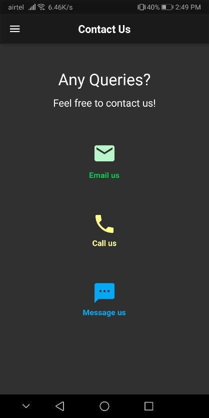

# Just Miles

Car Rental & Service System project is designed to aid the car rental company to enable renting of cars through an online system and also aid the car service company to enable booking car service through an online system. It helps the users to search for available cars view profile and book the cars for the time period and to explore different types of car services and to book the particular service that user wants to avail. It has a user-friendly interface which helps the user to check for cars and rent them for the period specified along with the car service.

The app is made using Flutter and Firebase.

## User interface:

### Landing

### Authentication
Users can login with their account or create a new account.

### Renting
A list of all the vehicles with featured vehicles on top.

### All sections
All the tabs available for user access. User can view his past orders in the bookings tab.

### Servicing form
Servicing page allows user to book a servicing for their vehicle.

### Contact Us
Different contact methods to contact the service provider.

